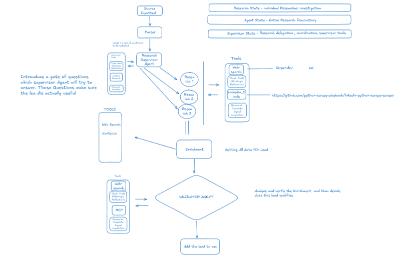

# FO Intelligence Agent

> An end-to-end system for **finding, qualifying, and querying family-office investment leads** from public filings — with correctness treated as a first-class concern at every layer.


**Live demo:** https://fo-micro-rag.vercel.app



---

## Table of contents

- [What it is](#what-it-is)
- [Design thesis](#design-thesis)
- [Tech stack](#tech-stack)
- [Architecture](#architecture)
- [Data model](#data-model)
- [Repository layout](#repository-layout)
- [Getting started](#getting-started)
- [Testing](#testing)
- [Field provenance log](#field-provenance-log)
- [Scheduled runs](#scheduled-runs)
- [Automatic RAG ingestion](#automatic-rag-ingestion)
- [The Log tab](#the-log-tab)
- [Deploying to Render](#deploying-to-render)
- [Notable engineering decisions](#notable-engineering-decisions)
- [Known limitations](#known-limitations)

---

## What it is

Two subsystems that share a data contract:

| Subsystem | Path | Role |
| --- | --- | --- |
| **Pipeline** | `app/` | A LangGraph research agent that takes a raw entity off a discovery queue, runs it through a fixed question battery → multi-wave enrichment → a validation layer, and emits a structured, evidence-backed record. Every field carries provenance and a verification status. |
| **Micro-RAG** | `micro_rag/` | A retrieval system over the qualified records with **three mechanical grounding gates**, so a generated answer can only assert what the underlying data provably supports. Deployed as a Next.js app on Vercel + Supabase. |

## Design thesis

The domain punishes false positives. A "family office" that is actually a plain RIA, a bank, or a mutual fund is worse than no lead at all, and a fabricated contact is worse still. The guiding principle throughout:

> **Ship only what the evidence supports; leave everything else honestly blank.**

Concretely:

- **Claim-ledger model** — every value is a `Claim` with a `status` (`confirmed` / `single_source` / `could_not_verify` / `contradicted` / …), a source class, and a verification method.
- **Cross-class corroboration** — a claim is promoted to `verified` only when a *different* class of source independently confirms it.
- **Release rule** — any high-value field that fails validation is stripped and blanked before assembly, with an audit trail (`audit_rejected_values`).
- **Identity gating on answer polarity, not just status** — the firm-is-a-genuine-family-office check rejects a *settled-but-negative* answer, not only an unresolved one.
- **Grounding enforced in code, not by prompt** — a post-generation entailment gate strips any sentence whose `[record:field]` citation doesn't resolve to a real, settled field, and discards the whole answer if too much was stripped.

---

## Tech stack

### Pipeline (`app/`)
| Concern | Choice | Version |
| --- | --- | --- |
| Language | Python | 3.12 |
| Agent graph | LangGraph + langchain-core (StateGraph only) | `langgraph 1.2`, `langchain-core 1.4` |
| Data models | Pydantic | 2.7+ |
| Storage | SQLite (WAL mode) via `aiosqlite` | stdlib + `aiosqlite 0.20` |
| HTTP | httpx (async, pooled) | 0.27+ |
| LLM | Ollama Cloud (default) · Anthropic (optional) | OpenAI-compatible API |
| Tools | SEC EDGAR · Serper (Google SERP) · Snov.io (email + LinkedIn profiles) · GDELT · ProPublica · `dnspython` · vendored Scrapy scraper (job postings only) | — |
| Page fetch | `crawl4ai` (headless Chromium, JS-rendering) · `trafilatura` (free fast path) | — |
| Docs/extraction | `openpyxl` (XLSX export) | — |
| Local UI/API | FastAPI + Uvicorn | 0.115+ |
| Tests | pytest + pytest-asyncio (fully offline) | 8+ |

### Micro-RAG ingest (`micro_rag/ingest/`)
| Concern | Choice |
| --- | --- |
| Language | Python 3.12 |
| Vector store | PostgreSQL 16/17 + **pgvector** (`vector(384)`, HNSW index) |
| Driver | `psycopg2` |
| Embeddings | `sentence-transformers/all-MiniLM-L6-v2` (384-dim) via `transformers` |

### Micro-RAG web (`micro_rag/web/`)
| Concern | Choice | Version |
| --- | --- | --- |
| Framework | Next.js (App Router, Turbopack) | **16.2.12** |
| UI | React | 19.2 |
| Styling | Tailwind CSS | v4 |
| Language | TypeScript | 5 |
| DB driver | `pg` (node-postgres) | 8.22 |
| Query-time embeddings | `@xenova/transformers` (ONNX, WASM/native) | 2.17 |
| Validation | `zod` | 4 |
| LLM | Ollama Cloud (`gemma4:31b`, non-reasoning — chosen for latency) | — |
| Hosting | Vercel (serverless) + Supabase (managed Postgres/pgvector) | — |

---

## Architecture

### Pipeline (`app/`)

```
Discovery queue
      │
      ▼
┌─────────────────────── Layer 1: Research ───────────────────────┐
│ Parser → LangGraph supervisor/researcher → Verdict              │
│ 11-question battery across 3 lanes (identity · people · signals)│
│ HARD gates evaluated mechanically → pursue / pursue_low / reject│
└─────────────────────────────────────────────────────────────────┘
      │  (pursue / pursue_low)
      ▼
┌──────────────── Layer E: Enrichment (wave-based) ───────────────┐
│ wave -1  free derivation from discovery data                    │
│ wave  0  cheap identity gate (is this really a family office?)  │
│ wave  1  actionability core (decision-maker · contact · signal) │
│ wave  2  depth (survivors only)                                 │
└─────────────────────────────────────────────────────────────────┘
      ▼
┌──────────────── Layer V: Validation ────────────────────────────┐
│ V1 source-supports-claim (LLM judge) · V4 contradictions        │
│ V5 staleness + firm-is-FO hardening · V6 completeness           │
│ cross-class corroboration · release rule                        │
└─────────────────────────────────────────────────────────────────┘
      ▼
   Layer D: dataset assembly → SQLite (source of truth)
```

### Micro-RAG query path (`micro_rag/web/`)

```
query ──▶ understandQuery (heuristic: filters + intent, ~0ms)
      ──▶ hybridRetrieve  (structured pre-filter → pgvector semantic
                           + lexical ts_rank → Reciprocal Rank Fusion)
      ──▶ Gate 1  retrieval floor (decline if nothing clears threshold)
      ──▶ generateAnswer (single Ollama call, tagged [record:field])
      ──▶ Gate 2  entailment verify (strip untagged/invalid sentences;
                                     discard answer if >30% stripped)
      ──▶ Gate 3  status propagation (contradicted/unverified fields are
                                      never put in front of the model)
```

- **Filter relaxation** — never silently falls through to an unfiltered search; each relaxed constraint is reported.
- **Failure taxonomy** — distinct, honest messages for out-of-scope / no-match / low-confidence / ungroundable, instead of a hallucinated answer.

---

## Data model

### Pipeline — SQLite (`app/schema.sql`)
Source of truth for everything the pipeline produces.

| Table | Purpose |
| --- | --- |
| `entities` | canonical name + aliases per lead |
| `entity_sources` | raw discovery-feed rows (13F, ADV, etc.) |
| `claims` | the claim ledger — one row per field/question answer, with `status`, `source_class`, `verification_method`, `wave` |
| `decisions` | Layer-1 verdicts (`pursue`/`pursue_low`) + rationale + `thin_reason` |
| `rejections` | rejected leads + `stage` + reason code |
| `enrichment_runs` | per-entity Layer E/V outcome + cost bookkeeping |
| `field_status`, `findings` | validation output (V1–V6) |
| `audit_rejected_values` | release-rule kills (what was blanked and why) |

### Micro-RAG — Postgres + pgvector (`micro_rag/ingest/schema.sql`)

| Table | Purpose |
| --- | --- |
| `records` | one row per qualified entity (typed columns: `entity_type`, `hq_state`, `aum_usd`, `mandates text[]`, principal fields, `outcome`, `source`) |
| `chunks` | 6 facet chunks/record; `embedding vector(384)` with an **HNSW** index + a generated `tsvector` column for lexical rank |
| `provenance` | per-field audit trail the grounding layer cites from (`status` gates what the model may see) |
| `query_log` | every query's parsed filters, retrieved ids, gate decisions, strip fraction — for evaluation |

Two data sources coexist in `records` via a `source` column (`pipeline` vs `csv_import`); each ingest prunes only its own source, and pipeline records win on `record_id` overlap.

---

## Repository layout

```
.
├── app/                     # Python pipeline (Layers 1 / E / V / D)
│   ├── graph.py             #   LangGraph wiring
│   ├── researcher.py        #   researcher lane (ReAct over tools)
│   ├── verdict.py           #   mechanical gates + LLM verdict
│   ├── enrichment.py        #   waves -1..2 + reserve-pool orchestration
│   ├── validation.py        #   V1/V4/V5/V6, cross-class rule, release rule
│   ├── dataset.py           #   Layer D assembly
│   ├── db.py / schema.sql   #   SQLite storage
│   ├── tools/               #   EDGAR, Serper, Snov.io, Crawl4AI, GDELT, DNS, key rotation
│   └── llm.py               #   Ollama Cloud / Anthropic chat models
├── micro_rag/
│   ├── ingest/              # Python: SQLite/CSV → Postgres+pgvector
│   │   ├── build_records.py #   claim ledger → record row
│   │   ├── chunks.py        #   6-facet chunker (+ contact-leak guard)
│   │   ├── embeddings.py    #   local MiniLM embeddings
│   │   ├── ingest.py        #   pipeline-record ingest
│   │   ├── ingest_csv.py    #   external CSV ingest (co-resident source)
│   │   └── schema.sql       #   records / chunks / provenance / query_log
│   └── web/                 # Next.js 16 app (retrieval + grounding + UI)
│       ├── app/api/         #   /query (SSE stream), /health, /record/[id]
│       ├── lib/             #   retrieval, grounding, ollama, embeddings, ...
│       ├── components/      #   SearchApp, EvidenceDrawer, RecordCard, ...
│       └── scripts/         #   fetch-model.sh, contrast-check.mjs
├── tests/                   # 242 offline tests (pytest)
├── vendor/                  # vendored LinkedIn scraper (Scrapy) — job postings only
├── docs/                    # design specs (the "why" behind each layer)
├── run_enrichment.py        # driver: Layer E/V/D over pursue/pursue_low leads
├── run_layer1_next.py       # driver: Layer-1 triage over the next N leads
└── requirements.txt
```

---

## Getting started

### Prerequisites
- Python 3.12
- Node.js 20+ (for the RAG web app)
- PostgreSQL 16/17 with the `pgvector` extension — Supabase, Neon, or `pgvector/pgvector` in Docker (RAG only)

### 1. Pipeline

```bash
pip install -r requirements.txt
cp .env.example .env            # fill in keys (Serper, Snov.io, Ollama, ...)
crawl4ai-setup                  # one-time: installs the headless browser fetch_page needs

python run_layer1_next.py 200   # triage the next 200 discovery leads (Layer 1)
python run_enrichment.py        # enrich/validate/assemble the qualified leads
```

### 2. Micro-RAG

```bash
# ingest (Python)
export DATABASE_URL=postgresql://...          # Postgres + pgvector
python micro_rag/ingest/ingest.py             # pipeline records
python micro_rag/ingest/ingest_csv.py         # + external CSV (optional)

# web app
cd micro_rag/web
npm install
bash scripts/fetch-model.sh                   # one-time: ~23MB embedding model
cp .env.local.example .env.local              # DATABASE_URL + OLLAMA_API_KEY
npm run dev                                    # http://localhost:3000
```

Deploy: `vercel deploy --prod` with `DATABASE_URL` + `OLLAMA_API_KEY` in the project env. The ONNX embedding model is force-traced into the serverless function via `next.config.ts`.

---

## Testing

```bash
PYTHONPATH=. python -m pytest -q     # 242 passing, fully offline
```

The LLM layer falls back to a deterministic fake model when no API key is set, so the suite needs no network or credentials.

---

## Field provenance log

Every time the pipeline runs it records, in a fetchable JSON form, **how each output lead field was obtained** -- which wave, which tool call, which URL, which validation checks, what else was found and rejected, or *why* a blank cell is blank. A reader looking at a shipped cell can see exactly how its value was produced; the log and the sheet share one cell-decision function (`resolve_cell`) so they can never disagree on what a cell contains.

**Where it lives.** Each run's log is written to `<db dir>/runs/<run_id>/field_provenance.json` (self-contained, `schema_version: 1`, directly fetchable by a static web page) and persisted to the `field_provenance` table (one row per run x entity x field, with scalar columns for filtering and a `record` JSON blob the page renders). The log is a **snapshot** of what that run shipped -- the claim ledger keeps moving, the log does not, so a value the log explains is always the value the run produced.

**`blank_reason` codes** (present only when a cell is blank, first match wins):

| code | meaning |
| --- | --- |
| `removed_failed_validation` | a value was found but blanked by the release rule; the original is in `audit_rejected_values` |
| `tool_unavailable` | the tool that would have found it was unavailable (a `tool_unavailable` source class or an `_error` extraction method) |
| `searched_not_found` | a search/lookup ran (or tool calls ran for the lead) but found no usable value for this field |
| `never_attempted` | no claim and no tool call for this field exists -- it was never tried |

**`why_not_used` vocabulary** (one code per losing claim in `alternatives`):

| code | meaning |
| --- | --- |
| `lower_provenance_tier` | a multi-valued claim in a worse provenance bucket than the one that shipped |
| `superseded` | status `superseded` |
| `failed_validation` | status `removed_failed_validation` (and not the shipped value) |
| `not_latest_write` | a single-valued claim beaten by a later write for the same field |
| `duplicate_value` | the same answer in the winning tier -- corroboration, not a rejection |
| `weaker_status` | anything else that lost |

**HTTP read endpoints** (every response carries `schema_version: 1`):

| Method + path | returns |
| --- | --- |
| `GET /api/runs?limit=` | the run rows, newest first (`limit` clamped 1..200) |
| `GET /api/runs/{run_id}` | the run row + a per-lead summary (`field_count`, `shipped_count`, `blank_count`) |
| `GET /api/runs/{run_id}/provenance?entity_id=&field=` | the stored records for that run (filtered when the params are given; an empty result is `200`, never `404`) |
| `GET /api/leads/{entity_id}/provenance?run_id=` | that lead's records, defaulting to the newest run that has any for it (also served at the singular `/api/lead/{entity_id}/provenance`) |

Example (elided):

```json
{
  "schema_version": 1, "run_id": "...", "count": 1,
  "records": [{
    "schema_version": 1, "entity_id": "disc_...", "canonical_name": "TARBOX FAMILY OFFICE, INC.",
    "field": "principal_email", "value": "rob@tarbox.com", "status": "single_source",
    "shipped": true,
    "how": {"summary": "A Snov.io name-targeted email lookup returned this address ...",
            "extraction_method": "snov_emails_by_name_domain", "source_url": "https://..."},
    "verification": {"method": "mx_check", "verified_at": "2026-08-14T19:12:40Z"},
    "checks": [{"check_id": "V7_email_domain_guard", "severity": "info", "detail": "..."}],
    "alternatives": [{"value": "info@tarbox.com", "why_not_used": "lower_provenance_tier"}],
    "tool_calls": [{"tool": "snov_emails_by_name_domain_raw", "ok": true,
                    "result_summary": "1 email returned", "matched_by": "url"}],
    "blank_reason": null
  }]
}
```

---

## Scheduled runs

The agent can run unattended on a schedule, stop as soon as it has what it was asked for, and publish what it confirms without anyone remembering to.

**Standing orders.** A schedule is `daily at HH:MM UTC` or `every N minutes`, and carries two limits:

| Field | Meaning |
| --- | --- |
| `target_confirmed` | stop the run once this many leads confirm (`ship` / `ship_with_caveats`) |
| `max_leads` | never process more than this many leads, whatever happens |

Either may be null. With neither, a run processes the queue until it runs out.

**How a run ends.** The run walks the lead queue in chunks, taking each lead through Layer 1 and then — only if the verdict warrants it — through enrichment. After every chunk it checks its stop conditions, in this precedence, and records which one fired in the run's `notes`:

| `termination` | meaning |
| --- | --- |
| `target_reached` | it got the confirmed leads it was asked for and stopped early |
| `max_leads_reached` | it hit the hard cap first |
| `leads_exhausted` | the queue emptied — the automatic termination; the run ends rather than waiting for work that will never arrive |
| `error` | an unhandled failure; the run is closed `failed`, never left `running` |

A single lead crashing never ends a run, and a lead Layer 1 rejects never reaches the expensive enrichment half.

**Endpoints:** `GET/POST /api/schedules`, `PATCH/DELETE /api/schedules/{id}`, `POST /api/schedules/{id}/run-now` (fire now, without waiting for the window), `GET /api/scheduler/status` (whether the loop is *actually* running, the next schedule due, and the RAG queue depth).

## Automatic RAG ingestion

A lead that confirms during any scheduled run is queued for the micro-RAG immediately and ingested at the end of the run — no manual `micro_rag/ingest/ingest.py` step.

The two halves are deliberately split. Confirming a lead writes one row to the local `rag_queue` table: microseconds, no network, inside the run. Draining that queue talks to Postgres and loads a 384-dim embedding model, and happens after the run's leads are safely persisted. The RAG side is remote, free-tier and auto-pausing, and neither it nor torch may be allowed to fail a lead's enrichment.

Consequently:

- No `DATABASE_URL`, or no psycopg2/torch installed → the drain **skips**, rows stay `pending`, and the next drain picks them up. Ingestion is delayed, never dropped.
- A failing Postgres write → rows stay `pending` with the error recorded on the row.
- A lead re-judged between queueing and draining → marked `stale` and never published. (The pipeline must not publish a record it no longer stands behind — the failure the batch job's "latest run only" rule exists to prevent.)
- `POST /api/rag/drain` drains on demand, for the case the RAG was down when the run finished.

Records are built through the same `build_record` mapping the manual batch job uses, so an automatically-ingested lead is identical to a manually-ingested one.

## The Log tab

The web UI has two tabs. **Run** is the existing interactive lead-qualification view. **Log** is the history:

- the scheduler's live state, the schedules with their stop rules, and Run-now / Pause / Delete;
- every run — scheduled or manual — newest first, with its status, why it terminated, and how many leads it processed and confirmed;
- expand a run to list the leads it touched;
- expand a lead to read its per-field log: the value, the plain-English account of how it was obtained, the tool calls behind it, the competing values that lost and why, and for a blank cell the reason it is blank.

Each level is fetched only when expanded, so opening the tab costs a single request.

## Deploying to Render

`render.yaml` is a complete blueprint: `render blueprint launch`, then set the secrets in the dashboard.

It provisions **one** web service with a persistent disk, and the scheduler runs as an asyncio task inside it rather than as a separate Cron Job or worker. That is forced by the data, not a shortcut: the pipeline's entire state is a SQLite file, and a Render disk mounts to exactly one service — a second service would get its own filesystem and its own empty database.

Three things follow, and all three matter:

- **Never scale past one instance or one worker.** Two instances means two schedulers firing the same standing orders and two SQLite writers.
- **Not the free tier.** Render spins an idle free service down, and a spun-down service fires no schedules.
- **The disk is the only copy** of every lead ever qualified. Keep the mount path stable across deploys.

| Env var | Purpose |
| --- | --- |
| `FOIA_DB_PATH` | `/var/data/foia.db` — on the disk, not the ephemeral filesystem |
| `FOIA_SCHEDULER` | `1` arms the in-process scheduler loop (off by default locally) |
| `FOIA_SCHEDULER_POLL_SECONDS` | how often to check for due schedules (default 60) |
| `OLLAMA_API_KEY`, `SERPER_API_KEY`, `SNOV_*`, `SCRAPEOPS_API_KEY` | pipeline credentials — dashboard secrets, never in the blueprint |
| `DATABASE_URL` | micro-RAG Postgres; unset means confirmed leads stay queued rather than ingested |

---

## Notable engineering decisions

- **Correctness caught by reading real output, not just tests.** Several integrity bugs — an identity gate matching on claim *status* rather than answer polarity; a citation-tagging gate splitting on abbreviation periods and orphaning tags — were found by auditing the actual shipped rows, then locked down with regression tests.
- **Grounding is mechanical.** The entailment gate is plain code over `[record:field]` tags resolved against a provenance fact-sheet — prompt instructions don't count toward it.
- **Idempotent, re-judgeable enrichment.** Completed entities aren't re-processed by default; a `force` flag re-judges them when gate logic changes, so a policy change doesn't silently replay stale outcomes.
- **Latency, measured not guessed.** Per-phase timing showed retrieval at 0.75s and the LLM calls dominating; the query-understanding LLM call was replaced with a deterministic parser and the reasoning model swapped for a plain one, cutting query time ~50s → ~15s.

## Known limitations

- **RAG latency floor (~15s/query)** sits entirely in the single Ollama Cloud generation call; a faster inference provider (e.g. Anthropic, already supported) would bring it to a few seconds.
- **Superlative/aggregate queries** ("largest AUM") use hybrid retrieval, which returns a *relevant* set rather than a true `MAX`; the structured aggregate path exists but isn't always routed to.
- **Discovery is upstream and out of scope** — the pipeline qualifies leads it's handed; sourcing the discovery queue is a separate concern.

---

*Design specifications for each layer live in [`docs/`](./docs).*

## License

MIT
